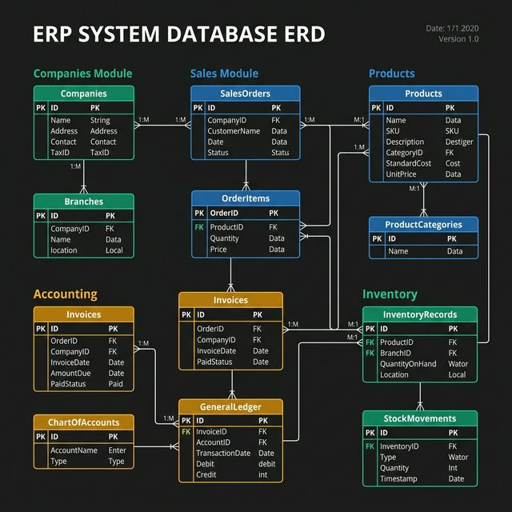
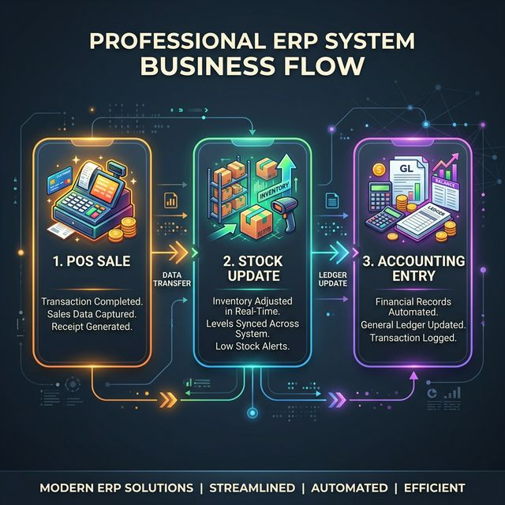

# Reporte de Análisis: ERP NodoSur

## 📊 Arquitectura de Base de Datos

### Entidades Principales y Relaciones
El sistema está diseñado para ser multi-empresa y multi-entidad (CUITs), con un fuerte enfoque en la automatización contable.

#### 1. Gestión de Identidad y Empresa
- `companies`: Nodo central del sistema.
- `company_members`: Relaciona usuarios (`auth.users`) con empresas, con roles definidos.
- `legal_entities`: Permite a una empresa operar bajo distintos CUITs/Razón Social.
- `invitations`: Flujo de onboarding para nuevos colaboradores.

#### 2. Operaciones Comerciales
- `products`: Catálogo con control de stock y precios.
- `inventory_movements`: Auditoría de cada entrada/salida de stock.
- `sales` / `sale_items`: Generado habitualmente vía POS.
- `purchases` / `purchase_items`: Registro de compras a proveedores.
- `expenses`: Gastos operativos categorizados.

#### 3. Automatización Contable (Partida Doble)
- `accounts`: Plan de cuentas autogenerado por empresa.
- `journal_entries`: Asientos contables generados automáticamente por triggers en Ventas y Gastos.
- `journal_entry_lines`: Detalle del Debe/Haber de cada asiento.

### Diagrama de Relación (ERD)
````mermaid
erDiagram
    COMPANY ||--o{ COMPANY_MEMBER : has
    COMPANY ||--o{ LEGAL_ENTITY : operates_as
    COMPANY ||--o{ ACCOUNT : owns
    COMPANY ||--o{ PRODUCT : catalogs
    COMPANY ||--o{ SALE : records
    COMPANY ||--o{ EXPENSE : records
    COMPANY ||--o{ JOURNAL_ENTRY : generates

    SALE ||--|{ SALE_ITEM : contains
    SALE ||--o| JOURNAL_ENTRY : automates
    EXPENSE ||--o| JOURNAL_ENTRY : automates
    JOURNAL_ENTRY ||--|{ JOURNAL_ENTRY_LINE : details
    JOURNAL_ENTRY_LINE }|--|| ACCOUNT : affects

    PRODUCT ||--o{ INVENTORY_MOVEMENT : logs
    PRODUCT ||--o{ SALE_ITEM : sold_in
    PRODUCT ||--o{ PURCHASE_ITEM : bought_in
````

## 💼 Flujo de Negocio

### El Core: Cierre Automático del Ciclo
El flujo principal (Venta) ilustra la potencia del sistema:
1. **Frontend (POS)**: El usuario selecciona productos y método de pago.
2. **Database (RPC/Triggers)**:
    - Se valida el stock.
    - Se registra la venta y sus items.
    - Se actualiza el stock automáticamente.
    - Se genera un movimiento de inventario.
    - **Trigger Contable**: Se dispara un asiento en el Libro Diario (Caja vs Ventas/IVA Debit).

## 💻 Arquitectura Frontend

- **Tecnología**: Next.js (App Router), TailwindCSS, Lucide Icons.
- **Estructura**: `features/` (Modular por dominio), `actions/` (Server Actions para lógica segura), `lib/` (Singletons y configuración).
- **Interacción con DB**: Uso intensivo de **Server Actions** para mutaciones, integrando RLS (Row Level Security) nativo de Supabase para seguridad multi-empresa.
- **UX/DX**: Diseño premium con glassmorphism, modo oscuro integrado y navegación fluida orientada a KPIs (Dashboard).

---
### Esquemas Gráficos




